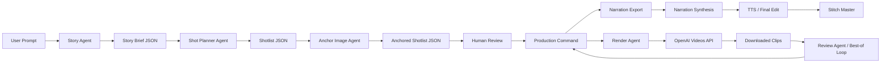

# Agent Workflow

`Multiversal Pictures` uses a staged agent workflow instead of one giant prompt.



## Roles

- `Story Agent`
  - turns a rough premise into a visual story brief
  - defines audience, tone, character bible, story beats, and continuity notes
- `Shot Planner Agent`
  - converts the brief into a renderable `shotlist.json`
  - keeps `project.characters` and richer shot-level planning fields alive through the final shot list
  - ensures every shot has concrete camera, setting, lighting, action, mode, continuity, and narration fields
- `Anchor Image Agent`
  - generates a still opening-frame anchor for each `mode=generate` shot
  - normalizes the image to the exact target video size
  - injects the normalized file into `input_reference`
- `Production Command`
  - accepts either a story prompt or an existing shot list
  - can optionally generate anchors before rendering
  - launches narration synthesis and shot rendering in parallel when a shot list is available
  - can optionally run the review loop before stitching
  - stitches the final master video after both tracks are ready
  - keeps the full storybook pipeline behind one high-level entrypoint
- `Narration Export`
  - converts the shot list into a voiceover script with timing cues and SFX notes
  - produces a clean handoff for TTS or human voice recording
- `Narration Synthesis`
  - generates per-shot narration audio with OpenAI TTS
  - aligns each line to shot timing, builds one master narration track, and writes subtitle sidecars
- `Final Edit`
  - can mix narration, optional background music, and optional clip ambience
  - ducks music under narration for cleaner storybook audio
  - can embed subtitle tracks into the stitched master or burn them into frames
- `Render Agent`
  - executes the shot list with the OpenAI Videos API
  - enforces mode-specific payload rules for `generate`, `extend`, and `edit`
  - polls job status and downloads result assets
  - can render independent shots concurrently
  - keeps clips visually expressive without relying on spoken dialogue in-frame
- `Stitch Step`
  - combines finished shot clips into one master video
  - runs after render or as a separate recovery step
- `Review Agent`
  - scores thumbnail and spritesheet assets for continuity, composition, anatomy, prop completeness, action match, and subtitle safe area
  - can trigger a balanced best-of loop and auto-select the highest scoring candidate
  - decides whether to keep, edit, or rerender

## Why this is more stable

- one prompt rarely preserves character continuity across multiple clips
- a story brief gives the planner a stable source of truth
- a shot list makes the render layer deterministic and retryable
- narration-led storybook videos avoid unstable lip-sync and inconsistent in-video speech
- anchor images lock composition, character look, and palette before video generation
- failed clips can be rerun without rebuilding the whole story

## Recommended operating loop

1. write or paste a short story prompt
2. run `generate-shotlist`
3. inspect the generated brief, characters, and shot continuity fields
4. run `generate-anchors` when you want stronger composition and character lock
5. hand off to the production command
6. let narration synthesis and shot rendering overlap
7. run `review-shots` or enable review inside `produce`
8. review narration timing and shot pacing together
9. export or inspect subtitles if needed
10. render one shot first when iterating manually
11. fix prompt or shot fields if needed
12. render the full sequence, optionally in parallel
13. stitch completed clips into one master video, optionally with narration audio and subtitles
14. use `edit` or `extend` for problem shots

## Commands

Generate a shot list from a story prompt:

```bash
multiversal-pictures generate-shotlist \
  --prompt-file examples/panda_story_prompt.txt \
  --output-preset storybook-vertical \
  --output examples/panda_story_generated.json
```

Preview the agent request without calling the API:

```bash
multiversal-pictures generate-shotlist \
  --prompt-file examples/panda_story_prompt.txt \
  --output examples/panda_story_generated.json \
  --dry-run
```

Export the narration script:

```bash
multiversal-pictures export-narration \
  --shotlist examples/panda_story_generated.json \
  --output runs/panda_story/narration.md
```

Generate narration audio:

```bash
multiversal-pictures synthesize-narration \
  --shotlist examples/panda_story_generated.json \
  --output-dir runs/panda_story/narration
```

Export subtitles:

```bash
multiversal-pictures export-subtitles \
  --shotlist examples/panda_story_generated.json \
  --narration-manifest runs/panda_story/narration/narration-manifest.json \
  --output runs/panda_story/narration/captions.srt
```

Render the generated shot list:

```bash
multiversal-pictures render-shotlist \
  --shotlist examples/panda_story_generated.json \
  --output runs/panda_story
```

Generate anchor images and a derived shot list:

```bash
multiversal-pictures generate-anchors \
  --shotlist examples/panda_story_generated.json \
  --output-dir runs/panda_story/anchors \
  --output-shotlist runs/panda_story/anchored-shotlist.json
```

Render in parallel and stitch automatically:

```bash
multiversal-pictures render-shotlist \
  --shotlist examples/panda_story_generated.json \
  --output runs/panda_story \
  --output-preset storybook-vertical \
  --jobs 4 \
  --stitch-output runs/panda_story/story.mp4 \
  --stitch-overwrite
```

Stitch an existing run later:

```bash
multiversal-pictures stitch-run \
  --run-dir runs/panda_story \
  --output runs/panda_story/story.mp4 \
  --overwrite
```

Stitch and mix narration audio:

```bash
multiversal-pictures stitch-run \
  --run-dir runs/panda_story \
  --output runs/panda_story/story-with-narration.mp4 \
  --narration-audio runs/panda_story/narration/narration.wav \
  --background-music /absolute/path/to/music.wav \
  --subtitle-file runs/panda_story/narration/captions.srt \
  --mute-clip-audio \
  --overwrite
```

Burn subtitles into the video:

```bash
multiversal-pictures stitch-run \
  --run-dir runs/panda_story \
  --output runs/panda_story/story-with-burned-subtitles.mp4 \
  --narration-audio runs/panda_story/narration/narration.wav \
  --background-music /absolute/path/to/music.wav \
  --subtitle-file runs/panda_story/narration/captions.srt \
  --burn-subtitles \
  --subtitle-preset large \
  --subtitle-layout auto \
  --mute-clip-audio \
  --overwrite
```

Preset options for burned subtitles: `storybook`, `large`, `minimal`, `high-contrast`.
Layout options for burned subtitles: `widescreen`, `vertical`, `auto`.
Burned subtitle presets auto-scale to the output resolution; use `STORYBOOK_SUBTITLE_FONT_SCALE` and `STORYBOOK_SUBTITLE_MARGIN_SCALE` if you need global tuning.
Output presets: `storybook-landscape`, `storybook-vertical`, `storybook-short`, `storybook-short-vertical`, `storybook-pro-landscape`, `storybook-pro-vertical`.
When selected, an output preset overrides the project-level default render size, clip duration, framing guidance, and subtitle defaults.

High-level production wrapper:

```bash
multiversal-pictures produce \
  --prompt-file examples/panda_story_prompt.txt \
  --output-preset storybook-vertical \
  --output runs/panda_story_vertical
```

```bash
multiversal-pictures produce \
  --shotlist examples/panda_story_generated.json \
  --output-preset storybook-vertical \
  --output runs/panda_story_vertical
```

Quality-first production wrapper:

```bash
multiversal-pictures produce \
  --shotlist examples/panda_story_generated.json \
  --output-preset storybook-pro-vertical \
  --with-anchors \
  --with-review \
  --review-best-of 3 \
  --output runs/panda_story_pro_vertical
```

Standalone review pass:

```bash
multiversal-pictures review-shots \
  --run-dir runs/panda_story_pro_vertical \
  --best-of 3 \
  --threshold 0.78
```

The production wrapper is the recommended entrypoint when you want one command to cover prompt ingestion, parallel narration/render work, and final stitching.

## OpenAI APIs used

- Planning: [Responses API](https://developers.openai.com/api/docs/guides/text)
- Structured planning output: [Structured Outputs](https://developers.openai.com/api/docs/guides/structured-outputs)
- Anchor generation: [Image generation](https://developers.openai.com/api/docs/guides/image-generation)
- Rendering: [Video generation with Sora](https://developers.openai.com/api/docs/guides/video-generation)
- Video job endpoints: [Videos API Reference](https://developers.openai.com/api/reference/resources/videos)
