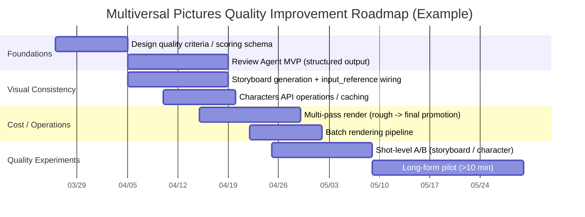

# Deep Research: How to Significantly Improve Short-Form and Long-Form Video Quality Using Only the OpenAI API  
*(Applies to: multiversal-pictures GitHub project / Date: 2026-03-25 KST)*

## Executive Summary

This project (`multiversal-pictures`) already has a staged workflow instead of relying on "one giant prompt": **Story Agent -> Shot Planner Agent -> Render(N) + Narration(TTS) in parallel -> Stitch (final composite)**. The documentation also already describes an iterative loop where problematic shots are improved through `edit` and `extend`. citeturn41view0turn20view4turn13view2

To improve video quality in a meaningful way, simply using a better model such as `sora-2-pro` is not enough. You need to combine **(1) consistency control (character/style/color palette)**, **(2) automated quality evaluation (Review Agent) plus automated regeneration/edit loops**, and **(3) resolution, duration, and shot-structure strategy (short, clear shots -> stitching)**. OpenAI's official Sora guidance explicitly states that higher resolution improves detail and lighting transitions, and shorter clips follow instructions more reliably. citeturn26view0turn26view1

In particular, OpenAI's **Videos API (Sora)** supports not only text/image-based generation, but also **editing (POST `/videos/edits`)**, **extension (POST `/videos/extensions`)**, and **reusable character assets (Characters API)**. That means a large portion of "fixing quality in post" can be handled **within the OpenAI API itself**, without external paid services. citeturn23view0turn23view1turn25view3turn26view0turn26view1

Cost is ultimately dominated by video generation, which is priced per second. According to OpenAI pricing, `sora-2` costs **$0.10/sec (720p)**, while `sora-2-pro` costs **$0.30/sec (720p)**, **$0.50/sec (1024p)**, and **$0.70/sec (1080p)**. Batch processing generally cuts that roughly in half. citeturn30view3turn33view1turn27view0turn27view1  
For that reason, for "long-form (>10 minutes)," a realistic default is not to render everything in 1080p Pro, but to use **`sora-2` for the rough cut** and selectively replace only key shots with **`sora-2-pro`** as part of a **multi-pass quality strategy**. citeturn26view1turn30view3

> Unspecified constraints (not stated in the request): **input video resolution (including whether there is any external live-action or preexisting source video), target platform (YouTube/TikTok/Instagram/etc.), and budget ceiling** were not specified. This report treats them as "undecided" and presents tradeoffs and cost ranges by option. citeturn41view0turn30view3

## Repository Architecture and Media Pipeline Analysis

### Workflow Overview and Design Intent

`docs/agent-workflow.md` defines the core of the project as a "staged agent workflow" and explicitly documents the flow from user input to final composition, including the Review/Edit/Extend loop. The flowchart in the document is structured as **User Prompt -> Story Agent -> Story Brief JSON -> Shot Planner -> Shotlist JSON -> Human Review -> Production Command -> (Narration Export -> Narration Synthesis -> Final Edit) + (Render Agent -> OpenAI Videos API -> Downloaded Clips -> Review/Edit/Extend Loop) -> Stitch Master**. citeturn41view0

This structure is intended to improve "character continuity" and "retryability." The document itself emphasizes that "a single prompt easily breaks multi-clip character continuity" and that using a shot list makes the rendering layer deterministic while allowing retries only for failed shots. citeturn41view0

### Major Components (Code/Modules) Related to the Media Pipeline

The following components were confirmed to be **directly involved in the media pipeline** in this repository. Ambiguous or unconfirmed items are listed separately.

- **Agents / Structured Outputs**
  - `openai_responses.py`: includes a client that generates structured output via `/responses` using JSON Schema, with `text.format.type="json_schema"` and `strict=True`. citeturn16view2turn17view2  
  - `agents.py`: defines the Story Agent and Shot Planner Agent and generates Story Brief -> Shotlist through chained calls. It includes guidance such as "family-friendly," "narration-led storybook," and "character continuity." citeturn17view1turn17view2  
  - The default agent model is configured to use environment variable `OPENAI_AGENT_MODEL`, with default `gpt-5-mini`. citeturn17view1

- **Shotlist Generation / Render Request Construction**
  - `shotlist.py`: in `build_shot_request()`, constructs the Videos API payload (prompt/model/size/seconds). Defaults are `"sora-2-pro"` for `OPENAI_VIDEO_MODEL`, `"1280x720"` for `OPENAI_VIDEO_SIZE`, and `"8"` for `OPENAI_VIDEO_SECONDS`. citeturn15view0turn15view2  
  - In extend/edit mode, it looks up the source video ID and includes `payload["video"] = {"id": ...}`. citeturn15view5turn13view2

- **Videos API Execution (Generate/Extend/Edit) and Result Download**
  - `openai_videos.py`: includes a client that calls `/videos`, `/videos/extensions`, `/videos/edits`, `/videos/{id}`, and `/videos/{id}/content`. citeturn8view2turn7view4  
  - `rendering.py`: branches per shot into `create_video` (generate), `create_extension` (extend), and `create_edit` (edit), then polls until completion and downloads `variant` assets such as video/thumbnail/spritesheet. citeturn13view2turn13view5  
  - Download variant extensions are mapped as `video=.mp4`, `thumbnail=.webp`, and `spritesheet=.jpg`. citeturn13view5

- **TTS, Subtitles, and Final Composition (FFmpeg-Centered)**
  - `tts.py`: `synthesize_narration()` builds a narration plan from the shotlist, then uses `OpenAISpeechClient` to generate per-segment TTS, align and concatenate it, and generate subtitle sidecars. citeturn19view0turn18view3  
  - `production.py`: runs rendering (`render_shots`) and narration synthesis (`synthesize_narration`) **in parallel via `ThreadPoolExecutor`**, then combines them with `stitch_run`. The default TTS model is environment variable `OPENAI_TTS_MODEL` with default `gpt-4o-mini-tts`, and the default voice is `OPENAI_TTS_VOICE` with default `alloy`. citeturn20view4turn20view1  
  - `subtitles.py`: includes utilities that generate SRT/VTT/JSON subtitles using narration offsets (ms) and shot durations to build cues. citeturn18view4turn18view7  
  - `media.py`: obtains an ffmpeg executable through `imageio-ffmpeg` (and throws a guidance error if unavailable), then uses ffmpeg for concat/mux/burn/subtitle/audio mixing operations. citeturn12view3turn12view0turn12view2  
  - `stitching.py`: reads the run manifest and shotlist, collects completed shot videos in order, concatenates them, and muxes/burns narration, BGM, and subtitles when needed. citeturn10view2turn12view1

- **CLI and Operational Commands**
  - The documentation shows commands such as `generate-shotlist`, `export-narration`, `synthesize-narration`, `export-subtitles`, `render-shotlist`, `stitch-run`, and `produce`. Presets such as `storybook-vertical` and `storybook-short-vertical`, as well as parallel render via `--jobs`, are also documented. citeturn41view0

### Ambiguous / Unconfirmed Items (Difficult to Conclude from Docs/Code Alone)

- **A feature to "restore/remaster" input video (existing live-action or existing clips)**: the repository itself is centered on a Sora-based generation pipeline, and no explicit module dedicated to classical restoration/upscaling of external input video is visible. (However, the Videos API `edit` path can pass an existing generated video ID.) citeturn23view1turn15view5  
- **Storage / queue / distributed render infrastructure**: outputs currently appear to be written to local directories (`run_dir`), and it is difficult to conclude from the repository whether there is a DB, object storage, or message queue. citeturn20view4turn10view2

## Quality Improvement Techniques Achievable with Only the OpenAI API

Below is a breakdown of high-impact methods that can be layered onto the existing `multiversal-pictures` pipeline under the constraint of **no external paid services (OpenAI API only)**. In some cases, the actual media processing still uses local FFmpeg, but the **decision layer (what to fix/how to fix it)** and the **generation/editing layer** are handled through the OpenAI API. The repository already uses ffmpeg-based stitching. citeturn12view3turn41view0

### Core Levers That Most Improve Visual Quality

**Model and resolution strategy**  
Official docs distinguish `Sora 2` as better suited to speed and experimentation, and `Sora 2 Pro` as better suited to high-quality final content. citeturn26view1turn27view0turn27view1  
Because `sora-2-pro` also has different per-second prices by resolution tier (720p/1024p/1080p, e.g. $0.70/sec at 1080p), a multi-pass workflow where you **validate first at 720p/1024p and then promote to 1080p** is highly efficient in terms of quality per dollar. citeturn30view3turn27view0

**Break shots into short, explicit units and stitch them (quality stabilization)**  
The official Sora prompting guide recommends that "shorter clips follow instructions better" and that "two 4-second clips edited/stiched together may work better than a single 8-second clip." citeturn26view0  
Since `multiversal-pictures` already uses a shot-based stitching structure, it is aligned with the project's design philosophy to make **4-8 second shots the default for both short-form and long-form**, and then use extend/edit only to correct duration or motion for problematic shots. citeturn41view0turn25view3

**Use the Characters API for character consistency (very high perceived quality gain for long-form)**  
The Sora prompting guide explains that the Characters API helps you "create reusable characters that maintain a consistent appearance/identity across future generations," and it also specifies the reference video requirements (2-4 second MP4, 720p-1080p, 16:9 or 9:16). citeturn26view0  
Since the repository is already designed around a `create-character` capability (docs/client exist), this should be treated as the top improvement for preventing "character collapse" in long-form content. citeturn7view4turn41view0

**Storyboard (keyframe) -> video via `input_reference`**  
The Videos API `POST /videos` accepts `input_reference` using **either an image URL or a file ID (only one of the two)**. citeturn23view0  
That enables the following pattern:

- (a) **Generate a per-shot storyboard (or "look-direction keyframe") with GPT Image 1.5**, then  
- (b) feed that image into `input_reference` so the video is generated while **locking composition, costume, color palette, and character detail**

This is one of the strongest ways to hold onto details that tend to drift when you rely on prompts alone. The official video guidance explicitly states that generation can be steered with image references. citeturn26view1turn23view0turn30view4

### Editing, Color Grading, Upscaling, and Noise Reduction

**Targeted correction of only problematic shots via editing (remix)**  
The Videos API provides `POST /videos/edits` for completed videos, and the inputs are an "edit instruction prompt" plus a "source video id." citeturn23view1turn26view1  
That makes it possible to recompose only problematic shots using instructions such as "change the color grade," "clean up lighting/tone," "correct subject color," "simplify the background," "reduce camera shake/excess motion," or "reduce flicker."

**Practical upscaling: regenerate/re-shoot at a larger `size`**  
There is no documented API that performs classical super-resolution while preserving the exact same pixels. Instead, Sora 2 Pro supports 720p/1024p/1080p output options, and the docs explicitly state that higher resolution improves visual fidelity. citeturn27view0turn26view0turn30view3  
So if you want to achieve "upscaling" using only the OpenAI API in practical terms, the most stable approach is to **generate the same shot again at a larger `size`** (or re-edit it under the same concept).

**Noise/artifact reduction (video)**  
At the prompting level, you can use directives such as "clean, noise-free, filmic, stable grade," or use `/videos/edits` on an existing clip to request "reduce compression artifacts/banding/noise." citeturn23view1turn26view0turn26view1  
However, this is a **generation-based edit rather than a restoration filter**, so there is a risk that fine details change. Mitigations are listed in the risk section.

### Audio Quality Improvements (Narration/Mixing-Centered)

`multiversal-pictures` is fundamentally a "narration-led storybook" workflow, and the documentation explicitly recommends avoiding lip-sync and in-video dialogue in favor of external narration. citeturn41view0turn17view1  
That means audio quality can be significantly improved along the following three axes.

**TTS quality (voice/tone/delivery control)**  
The OpenAI TTS guide shows that using `gpt-4o-mini-tts` via `audio/speech` allows you to control **intonation, emotion, pace, tone, whispering, etc.** through instructions, and it also presents 13 built-in voices plus recommended voices such as `marin` and `cedar`. The docs also note that the voices are currently optimized for English. citeturn38view0turn38view1  
Since the repository currently defaults to `alloy`, there is immediate upside in **(1) switching the default voice to `cedar`/`marin`**, **(2) dynamically generating TTS instructions based on each shot's emotional arc**, and **(3) validating Korean speech quality through sample A/B tests**. citeturn20view4turn38view0

**Minimize conflict between clip ambience and narration**  
The docs already expose mix options such as `--mute-clip-audio` and "music ducking." In practice, if the shot's native audio is unstable, it is better to **mute the clip audio** (or lower it drastically) and build a clean storybook tone around narration plus controlled background sound. citeturn41view0turn20view3turn10view2

**Optional STT-based quality control / subtitle refinement**  
The OpenAI pricing page lists estimated per-minute costs for `gpt-4o-transcribe` and `gpt-4o-mini-transcribe` ($0.006/min and $0.003/min), so even long-form subtitle/script verification can be designed without excessive cost. citeturn30view1turn33view1  
That said, the repository already does a good job generating subtitles from the TTS script, so STT is primarily useful when **(a) using human-recorded narration**, **(b) trying to preserve clip ambience**, or **(c) validating multilingual subtitle quality**. citeturn41view0turn18view4

### Frame Interpolation, FPS Conversion, and Scene Transition Detection

**Frame interpolation**  
The official OpenAI Videos API references for generation/editing/extension expose parameters such as `prompt`, `model`, `size`, `seconds`, and video-ID-based edit/extend controls, but a parameter for "explicitly setting output FPS" is **not explicitly documented / remains unclear** in the docs reviewed. citeturn23view0turn23view1turn25view3turn26view1  
So it is difficult to perform frame interpolation **deterministically** using only the OpenAI API. Practical alternatives are:
- (a) use prompts such as "smooth motion, no stutter" to **steer motion quality** in Sora, or citeturn26view0  
- (b) if constraints are relaxed, perform FPS interpolation via local post-processing (FFmpeg/VapourSynth/etc.)

In the workflow proposed by this report, option (a) is treated as the "API-only" path, while option (b) is treated as an optional extension and included in the tradeoff comparison.

**Scene detection**  
Because this project is fundamentally "shot list = scene boundaries," the need for traditional scene detection is relatively low in the generation pipeline. citeturn41view0turn15view0  
However, if scene detection is needed for external input video (remaster/re-edit workflows), the repository's already-downloaded `thumbnail` and `spritesheet` assets can be scored by a vision model to identify likely cut boundaries, which is an architecturally efficient way to reduce sampling cost. citeturn13view5turn26view1

## End-to-End Workflows for Short-Form and Long-Form

The workflows below preserve the repository's current design assumptions (shot-based structure, parallel render+tts, stitching) while inserting **additional quality-improving stages** such as storyboard generation, character assets, automated review, and automated remix loops. citeturn41view0turn20view4

### Short-Form Workflow (<= 3 minutes)

#### Goals and Base Assumptions (including unspecified items)
- Target duration: 30-180 seconds (<= 3 minutes)
- Target platform / aspect ratio / resolution: **unspecified** -> default to either (a) 9:16 (720x1280) or (b) 16:9 (1280x720)
- Budget: **unspecified** -> recommend a default of "rough in Sora 2, promote only necessary shots to Pro" citeturn26view1turn30view3

#### Step-by-Step Pipeline and Required API Calls

1) **Shotlist generation (planning automation)**
- API: `POST /responses` (structured output, `json_schema`)  
- Input: story prompt, audience, language (Korean), visual style, shot count  
- Output: Story Brief JSON -> Shotlist JSON citeturn17view2turn16view2turn41view0

2) **Storyboard generation (shot keyframes) (recommended)**
- API: image generation (e.g. GPT Image 1.5)  
- Purpose: lock the "look/composition/costume/palette" first, then use it as `input_reference` during video generation citeturn23view0turn30view4turn21view3  
- Output format: PNG/JPEG recommended, one image per shot (or two: start/end)

3) **Optional: register the main character via the Characters API**
- API: `POST /videos/characters`  
- Input: 2-4 second MP4 (720p-1080p) citeturn26view0turn21search1  
- Output: `char_...` ID for later shot generation

4) **Shot rendering (default to short shots)**
- API: `POST /videos`  
- Recommendation: use 4-8 second shots; if a motion sequence needs continuity, extend it via `POST /videos/extensions` citeturn26view0turn25view3turn23view0  
- Parameters:
  - `model`: `sora-2` (rough) or `sora-2-pro` (final) citeturn26view1turn23view0  
  - `size`: 9:16 or 16:9 (e.g. 720x1280, 1280x720) citeturn23view0turn30view3  
  - `seconds`: generation commonly uses 4/8/12, extensions use 4/8/12/16/20 citeturn23view0turn25view3turn26view0  
  - `input_reference`: storyboard image (or data URL)  
  - `characters`: recommend no more than two citeturn26view0turn21search1  
- Result handling: video generation is asynchronous. Check status via `GET /videos/{id}`, then download via `GET /videos/{id}/content` (which the repository already implements). citeturn26view1turn13view2turn8view2

5) **Automated quality review (Review Agent) + automated correction loop**
- Input assets: each shot's `thumbnail.webp` and `spritesheet.jpg` (available through downloaded variants) citeturn13view5turn41view0  
- API: `POST /responses` (with vision) -> generate score/issues/edit prompt through JSON Schema  
- Correction paths (choose one):
  - Regenerate: re-run the same shot with `POST /videos` using a revised prompt
  - Targeted edit: use `POST /videos/edits` to fix only "color/lighting/subject errors" citeturn23view1turn41view0

6) **Narration synthesis (TTS)**
- API: `POST /audio/speech` (through the repository's `OpenAISpeechClient`) citeturn8view3turn38view0turn19view0  
- Recommendation: A/B test voices such as `cedar` and `marin`, and auto-generate `instructions` based on the emotional arc of each shot citeturn38view0turn18view3

7) **Subtitle generation and final stitching**
- Local: concat/mux/burn and audio mixing via ffmpeg (already provided by the repo) citeturn12view0turn12view2turn10view2turn41view0

#### Minimum Required Data Formats / Outputs
- `shotlist.json` (plan), `run-manifest.json` (render results), per-shot `video.mp4`, `thumbnail.webp`, `spritesheet.jpg`, `narration.wav`, and `captions.srt` citeturn13view2turn18view4turn41view0

#### Compute / Storage / Latency (Approximate)
- **API latency**: Sora is asynchronous (job creation -> poll/webhook -> download). The docs indicate that `sora-2-pro` is slower and more expensive. citeturn26view1turn27view0  
- **Local compute**: stitching, audio mixing, and subtitle burning are ffmpeg-based. As shot count grows, the system becomes increasingly I/O-heavy. citeturn12view3turn10view2  
- **Parallelism limits**: Sora models have tier-based RPM limits (for example, `sora-2` Tier 1 at 25 RPM and `sora-2-pro` Tier 1 at 10 RPM). citeturn27view1turn27view0

#### Rough Cost Estimate (Core Only)
- Assuming one full render of a 120-second short-form piece:
  - `sora-2` 720p: 120s x $0.10/s = **$12** citeturn30view3turn27view1  
  - `sora-2-pro` 1080p: 120s x $0.70/s = **$84** citeturn30view3turn27view0  
- Since retries/remixes can multiply that by 1.5x to 3x, **using automated review to minimize only the shots that truly need retries** is itself a major cost optimization. citeturn41view0turn23view1  
- When using Batch (offline rendering), the pricing page indicates that the per-second rate is roughly halved. citeturn30view3turn33view1turn26view1

### Long-Form Workflow (>10 minutes)

For long-form, the biggest risks are "cost per second" and "continuity collapse (character/tone/color)." Therefore the baseline assumption should be **chaptering + multi-pass (rough -> final) + fixed characters/storyboards + automated review**. citeturn26view1turn26view0turn30view3

#### Step-by-Step Pipeline (Recommended Long-Form Design)

1) **Script/structure by chapter**
- Run `generate-shotlist` not as "one 10-minute shotlist," but as something like **N chapters of 60-120 seconds each**  
- Reason: short clips and short shots follow instructions better, and problematic segments are easier to retry selectively citeturn26view0turn41view0

2) **Fix character assets (essential)**
- Register the protagonist / core objects through the Characters API and reuse them across the entire chapter set citeturn26view0turn21search1

3) **Fix the visual look (storyboard keyframes)**
- Create a "master keyframe set" per chapter for palette/composition guidance, and use it as `input_reference` for major shots citeturn23view0turn30view4

4) **Render (multi-pass)**
- Pass A (rough cut): render quickly in `sora-2` 720p or 1280x720 to validate story/rhythm/continuity citeturn26view1turn27view1  
- Pass B (final): among the shots that are working, re-render/remix only key shots (e.g. top 30%) in `sora-2-pro` at 1024p/1080p citeturn27view0turn30view3

5) **Automated review at scale + Batch**
- The video guidance explicitly says Batch API can be used for large offline queues. citeturn26view1turn30view3  
- Perform review on thumbnails/spritesheets, and remix/regenerate only low-scoring shots

6) **Narration / subtitles / stitching**
- The repository's `produce` command is documented as the recommended entry point for doing prompt ingestion + parallel render/TTS + stitching in one pass. citeturn41view0turn20view4  
- For long-form, it is operationally safer to produce per-chapter outputs first and then concatenate the chapter masters into a final master as a "two-stage stitching" process, which reduces failure blast radius. citeturn41view0turn12view0

#### Rough Cost Estimate (10 minutes = 600 seconds, one render pass)
- All `sora-2` at 720p: 600s x $0.10/s = **$60** citeturn30view3turn27view1  
- All `sora-2-pro` at 1080p: 600s x $0.70/s = **$420** citeturn30view3turn27view0  
- With Batch, the table shows the cost dropping roughly by half (e.g. 1080p Pro at $0.35/s). citeturn30view3turn33view1  
- Practical recommendation: for long-form, always use **selective Pro promotion** (e.g. only the most important 30% of shots at 1080p Pro) to balance cost and quality. citeturn26view1turn30view3

## Implementation Priorities, Risks, and Mitigations

### Implementation Priorities

The priorities below are ordered by strongest quality impact and cost efficiency.

The first priority is **automating the Review Agent and regenerating/editing/extending only problematic shots**. The project docs already assume a "Review / Edit / Extend Loop," so if this is turned into a **structured automated agent** rather than a human-only step, both success rate ("usable shot on first pass") and cost (retry count) improve at the same time. citeturn41view0turn23view1turn16view2

The second priority is the **combination of Characters API + storyboard (`input_reference`)**. In long-form content, continuity collapse is the most visible quality failure, and Sora explicitly states that reusable characters can be created through the Characters API. citeturn26view0turn27view0

The third priority is **multi-pass quality control** (rough in `sora-2`, selective promotion to `sora-2-pro` for finals). The official docs distinguish the models as "speed vs precision," and pricing is per second, so multi-pass rendering is the most honest cost-quality optimization available. citeturn26view1turn30view3

### Major Risks and Mitigations

**Runaway cost (the most practical risk)**  
- Cause: per-second billing plus increased retry/remix counts citeturn30view3turn23view1  
- Mitigation:
  - (a) use `sora-2` for rough passes and `sora-2-pro` only selectively for finals citeturn26view1turn30view3  
  - (b) reduce cost on large queues with Batch citeturn26view1turn30view3  
  - (c) use automated review to identify **only the shots that require retries** rather than re-rendering everything blindly citeturn41view0turn13view5

**Continuity collapse (character/color/costume)**  
- Mitigation: combine Characters API with storyboard `input_reference` assets citeturn26view0turn23view0

**API rate limits / parallelization limits**  
- `sora-2` and `sora-2-pro` have different RPM limits by tier (for example, Pro Tier 1 = 10 RPM), and exceeding that with excessive parallelism can cause failures and delays. citeturn27view0turn27view1  
- Mitigation: replace the repository's `--jobs` value with an RPM-aware dynamic limit, and move large-scale workloads to Batch citeturn41view0turn26view1

**Limits of frame interpolation / precise restoration ("traditional post filter" level)**  
- Because the OpenAI API docs reviewed do not explicitly define FPS control/interpolation, frame interpolation in the strictest sense is hard to guarantee with an API-only workflow. citeturn23view0turn26view1  
- Mitigation:
  - (a) prompt for "smooth motion / reduced instability" while acknowledging that it is not a full guarantee citeturn26view0  
  - (b) if organizational constraints allow it (still not an external paid service), expose local post-processing as an optional "plugin"

## KPI Design, A/B Test Design, Deliverable Checklist, Sample Code, and Tradeoff Comparison

### Recommended Measurable KPIs

In an OpenAI API-based generation pipeline, it is not enough to track only external KPIs such as views or retention. You also need **internal production-pipeline KPIs** to support iterative improvement.

- **Cost per finished minute ($/finished min)**: (total Sora-generated seconds x per-second rate + auxiliary call cost) / final runtime. Since `sora-2(-pro)` pricing is explicitly per second, this is easy to calculate. citeturn30view3turn27view0turn27view1  
- **Shot first-pass accept rate**: proportion of shots that pass automated review without being flagged as requiring edit/redo  
- **Shots per minute**: editing density, which strongly affects retention in short-form content  
- **Continuity score**: whether character/clothing/palette stay consistent, as judged by the Review Agent using thumbnails/spritesheets citeturn13view5turn26view0  
- **Audio clarity rating**: clarity and naturalness of TTS output across voice/instructions A/B tests citeturn38view0turn20view4

### A/B Test Design (Experimental Unit and Statistical Structure)

It is better to separate **experimental units** into "single shot" and "final completed video."

- **Shot-level A/B (fast iteration)**
  - A: text-only prompt  
  - B: storyboard `input_reference` + same prompt  
  - Measure: Review Agent scores (continuity/composition/noise/readability), first-pass acceptance rate, retry count citeturn23view0turn41view0

- **Final-video-level A/B (product metrics)**
  - A: all `sora-2` (720p)  
  - B: multi-pass (`sora-2` rough + key shots in `sora-2-pro` 1080p)  
  - Measure: finished cost per minute, production lead time, internal quality score, and platform watch retention when available

**Recommended sample size (practical guidance)**  
- Shot level: 30-100 shots of the same type is usually enough to observe meaningful differences in retry rate / acceptance rate, though formal statistical testing should be adjusted to the organization's data volume.  
- Finished-video level: you generally need at least 10-20 completed episodes to reduce variance, with topic/genre diversity controlled where possible.

### Deliverable Checklist

To productize "quality improvement" in this repository, the following deliverables are practically necessary.

- **Quality Review Agent module**
  - Input: `thumbnail.webp`, `spritesheet.jpg`, shot metadata
  - Output: JSON (score/issues/recommended action: keep/edit/redo/extend + edit prompt)  
  - Wiring: run automatically right after rendering results are downloaded citeturn13view2turn13view5turn16view2

- **Storyboard Generator module**
  - Shotlist -> generate per-shot keyframe images (or a style-bible image set)
  - Inject them into the shotlist via `input_reference` citeturn23view0turn30view4

- **Character management (register/cache/apply)**
  - Store/reuse `char_...` IDs in the shotlist's project block citeturn26view0turn15view2

- **Multi-pass render (rough -> final promotion)**
  - Promotion rules (e.g. top-scoring shots / key shots) should be externalized as configuration
  - Provide Batch rendering as an option citeturn26view1turn30view3

- **Operational guardrails**
  - Stop when the budget ceiling (total generated seconds / total cost) is exceeded
  - RPM-based concurrency limiting by account tier citeturn27view0turn27view1

### Sample Code and API Call Sequence

Below is a sample call sequence aligned with both the repository structure and OpenAI's official endpoint shapes. In actual implementation, it is recommended to adapt these to the repository's `OpenAIVideosClient`, `OpenAIResponsesClient`, and `OpenAISpeechClient` wrappers. citeturn16view2turn8view2turn8view3

#### Videos API: Create -> Check status -> Download

```bash
# 1) Create (POST /videos)
curl https://api.openai.com/v1/videos \
  -H "Authorization: Bearer $OPENAI_API_KEY" \
  -H "Content-Type: application/json" \
  -d '{
    "model": "sora-2-pro",
    "prompt": "A calm storybook-style shot ... (camera, lighting, palette, action)",
    "size": "1920x1080",
    "seconds": "4",
    "input_reference": { "image_url": "data:image/png;base64,...." }
  }'

# 2) Once polling (GET /videos/{id}) reports completion,
# 3) Download (GET /videos/{id}/content?variant=video) - the repository already supports variant downloads
```

- `POST /videos` accepts `prompt`, `model` (`sora-2` / `sora-2-pro`), `seconds`, `size`, and `input_reference` (`image_url` or `file_id`), among others. citeturn23view0turn26view1  
- Higher-end resolution (1080p) increases cost under `sora-2-pro`. citeturn30view3turn27view0

#### Videos API: Edit a problematic shot (remix)

```bash
curl https://api.openai.com/v1/videos/edits \
  -H "Authorization: Bearer $OPENAI_API_KEY" \
  -H "Content-Type: application/json" \
  -d '{
    "prompt": "Keep everything the same, but apply a warm cinematic grade, reduce banding/noise, and fix the character’s right hand anatomy.",
    "video": { "id": "video_123" }
  }'
```

The docs explicitly state that the Videos edit endpoint uses the form `prompt` + `video.id`. citeturn23view1

#### Audio API: Generate narration TTS

```bash
curl https://api.openai.com/v1/audio/speech \
  -H "Authorization: Bearer $OPENAI_API_KEY" \
  -H "Content-Type: application/json" \
  -d '{
    "model": "gpt-4o-mini-tts",
    "voice": "cedar",
    "input": "Today, a little panda wandered through the forest...",
    "instructions": "Warm and calm storybook narration, with a slightly slower speaking pace.",
    "response_format": "wav"
  }' \
  --output narration.wav
```

The TTS guide shows that `audio/speech` accepts `model`, `voice`, `input`, and `instructions` so you can control speaking style. citeturn38view0turn38view1

### Comparison Table of Alternative Approaches (Tradeoffs)

| Approach | Strengths | Weaknesses / Risks | Recommended Use |
|---|---|---|---|
| All `sora-2` at 720p | Cheapest ($0.10/sec), fast iteration citeturn30view3turn27view1 | Weaker than Pro in detail/stability citeturn26view1 | Mass short-form production, rough cuts |
| All `sora-2-pro` at 1080p | Highest-end results ("production-quality" per docs), supports 1080p citeturn26view1turn27view0 | Expensive ($0.70/sec), slower renders citeturn30view3turn26view1 | Ads, branded work, high-stakes single pieces |
| Multi-pass (rough in `sora-2` -> promote only key shots to Pro) | Best quality/cost balance, especially strong for long-form citeturn26view1turn30view3 | Higher pipeline complexity (needs promotion rules) | Long-form (>10 min), series operations |
| Text-only prompts | Simple to implement | Higher risk of continuity/look drift | Prototyping |
| Storyboard `input_reference` + prompt | Locks composition/look, improves reproducibility citeturn23view0turn26view1 | Adds image-generation cost and steps | Content where consistent art direction matters |
| Characters API | Prevents character collapse, high perceived gain in long-form citeturn26view0turn21search1 | Requires character reference video prep | Character-driven narrative (storybooks/series) |
| Automated Review Agent + `/videos/edits` | Reduces retry cost, automates a quality stabilization loop citeturn41view0turn23view1 | Evaluation criteria design matters; initial tuning required | Operational / repeated production |

### Recommended Mermaid Diagrams (Pipeline / Timeline)

#### Short-Form Pipeline (Recommended)

```mermaid
flowchart TD
  A[Story Prompt (KO)] --> B[Responses API: Story Brief JSON]
  B --> C[Responses API: Shotlist JSON]
  C --> D[ImageGen: Storyboard Keyframes per Shot]
  C --> E[Videos API: Create Character (optional)]
  D --> F[Videos API: Generate Shots (4-8s)]
  E --> F
  F --> G[Download: video + thumbnail + spritesheet]
  G --> H[Review Agent (Responses+Vision): Score/Issues]
  H -->|keep| I[TTS: audio/speech (narration)]
  H -->|edit/redo| J[Videos API: edits or re-generate]
  J --> G
  I --> K[Subtitles: SRT/VTT/JSON]
  G --> L[FFmpeg Stitch: concat + mix + subtitles]
  I --> L
  K --> L
  L --> M[Final Master MP4]
```

#### Implementation Roadmap Timeline (Example)



### Additional Recommended Visualizations / Dashboards (Defined as Outputs Rather Than Images)

If you want to actually add the requested "example images/diagrams" to the repo, the following deliverables are recommended.

- **Shot quality score board**: show thumbnails in a grid and overlay Review Agent score / issue tags (hands/face/noise/exposure/continuity) per shot  
- **Storyboard sheet (contact sheet)**: one board containing storyboard images, shot IDs, durations, and a one-line narration summary per shot  
- **Long-form chapter timeline**: display the ratio of "Pro-promoted shots," estimated cost, and lead time by chapter

All of these can be built from assets the repository already generates (`thumbnail`, `spritesheet`, `shotlist`, `narration`). citeturn13view5turn41view0turn18view3
